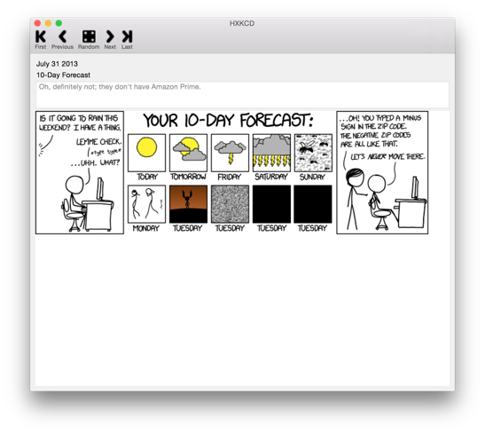

# HXkcd

HXkcd is a simple client that reproduces the behaviour of the original website [Xkcd] and gives you the possibility to move back and forth across the comic images.

The project is written in [Haskell] and follows the principles of [Functional Reactive Programming] using the library [Reactive-Banana].

[Xkcd]:http://xkcd.com/
[Haskell]:https://www.haskell.org/
[Functional Reactive Programming]:https://en.wikipedia.org/wiki/Functional_reactive_programming
[Reactive-Banana]:https://wiki.haskell.org/Reactive-banana